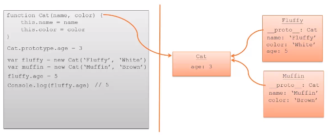
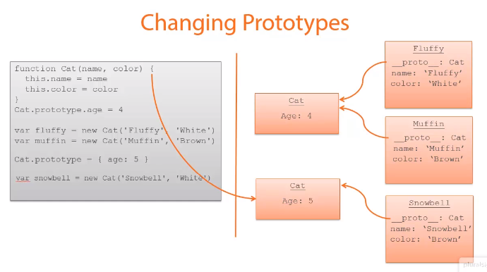
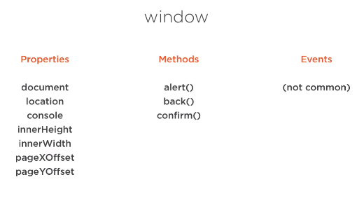
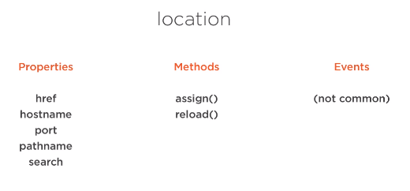
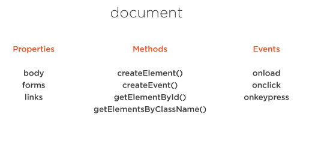

# notes

## JavaScript

### Language Features

#### Variables

##### `const`

A constant variable and cannot be reassigned.

```javascript
const carId = 42;
...
carId = 100; // error!
```

##### `let` 

A scope based variable which cannot be used before declared:

```javascript
console.log(carId); // error!
let carId = 42;
```

```javascript
if(true) {
    let foo = 9;
}
console.log(carId); // error!
```

#### Rest Parameters

Allows a function to accept an indefinite number of arguments as an array.

```javascript
function sendCars(...allCarIds){
    allCarIds.forEach(id => console.log(id));
}
sendCars(100, 200, 500);
// 100 200 555
```

Similar to `varargs` in Java, it can only appear once in the function argument list and must be the last declared:

```javascript
function sendCars(...allCarIds, day){ // error! - 'Comma is not permitted after rest element'
    allCarIds.forEach(id => console.log(id));
}
sendCars(100, 200, 500);
```

#### Destructuring Arrays

Declare variables to the values of that of the contents of an array.

```javascript
let carIds = [1, 2, 5];
let [car1, car2, car3] = carIds;

console.log(car1, car2, car3);
// 1 2 5
```

Elements can be skipped and joined together in a new array using a rest parameter:

```javascript
let carIds = [1, 2, 5];
let car1, remainingCars;
[car1, ...remainingCars] = carIds;

console.log(car1, remainingCars);
// 1 [2, 5]
```

```javascript
let carIds = [1, 2, 5];
let remainingCars;
[, ...remainingCars] = carIds;

console.log(remainingCars);
// [2, 5]
```

#### Destructuring Objects

Similar to arrays we can declare variables and assign their values to match that from an Object.

```javascript
let car = { id: 5000, style: 'convertible' };
let { id, style } = car;

console.log(id, style);
// 5000 convertible
```

Cannot be done multiline as compiler considers braces (`{}`) as a code block.

```javascript
let car = { id: 5000, style: 'convertible' };
let id, style;
{ id, style } = car; // error!

console.log(id, style);
```

Wrap in parenthesis (`()`) to compile:

```javascript
let car = { id: 5000, style: 'convertible' };
let id, style;
({ id, style } = car);

console.log(id, style);
// 5000 convertible
```

#### Spread

Opposite of destructuring arrays; an arrays contents can be *spread* into the arguments of the function.

Also works for strings.

```javascript
function startCars(car1, car2, car3) {
    console.log(car1, car2, car3);
}
let carIds = [100, 300, 500];
startCars(...carIds);
// 100 300 500

let carCodes = 'abc';
startCars(...carCodes);
// a b c
```

#### typeof()

```javascript
typeof(1); // number
typeof(true); // boolean
typeof('Hello'); // string
typeof(function(){}); // function
typeof({}); // object
typeof(null); // object
typeof(undefined); // undefined
typeof(NaN); // number
```

#### Type Conversions

Common conversions:

```javascript
// convert to string
foo.toString();

// convert string to integer
Number.parseInt('55'); // 55 as a number

// convert string to number
Number.parseFloat('55.99'); // 55.99 as a number
Number.parseFloat('55.99ABC'); // 55.99 as a number
Number.parseFloat('ABC55.99ABC'); // NaN
```

### Functions and Scope

#### IIFE's

*Immediately Invoked Function Expressions.*

The ending parenthesis call the function within the initial braces.

```javascript
(function() {
    let carId = 123;
    console.log('in function'); // in function
})();
```

Can be named and return.

```javascript
let app = (function() {
    let carId = 123;
    console.log('in function'); // in function
    return {};
})();

console.log(app); // {}
```

#### Closures

A closure gives you access to an outer function's scope from an inner function.

```javascript
let app = (function() {
    let carId = 123;
    let getId = function() {
        return carId;
    }
    return {
        getId: getId
    };
})();

console.log(app.getId()); // 123
```

In JavaScript, closures are the primary mechanism used to enable data privacy.

See [MDN](https://developer.mozilla.org/en-US/docs/Web/JavaScript/Closures) for more.

#### `call`

`call` allows for a function/method belonging to one object to be assigned and called for a different object.

```javascript
let o = {
    carId: 123,
    getId: function() {
        return this.carId;
    }
};
let newCar = { carId: 456 };

console.log(o.getId().call(newCar)); // 456
```

#### `apply`

With `apply`, you can write a method once, and then inherit it in *another* object, without having to rewrite the method for the new object. 

`apply` is very similar to `call`, except for the type of arguments it supports. You use an arguments array instead of a list of arguments (parameters).

```javascript
let o = {
    carId: 123,
    getId: function(prefix) {
        return prefix + this.carId;
    }
};
let newCar = { carId: 456 };

console.log(o.getId().apply(newCar, ['ID: '])); // ID: 456
```

#### `bind`

The `bind` method creates a new function that, when called, has its `this` keyword set to the provided value.

```javascript
let o = {
    carId: 123,
    getId: function() {
        return this.carId;
    }
};
let newCar = { carId: 456 };
let newFn = o.getId.bind(newCar);

console.log(newFn()); // 456
```

#### Arrow Functions

Similar to Lambda in Java.

```javascript
let getId = () => 123;
console.log(getId()); // 123

let getId2 = prefix => prefix + 123;
console.log(getId2('ID: ')); // ID: 123
```

Needs braces when more than one argument. For multi-line, wrap with curly braces and include `return` keyword.

```javascript
let getId = (prefix, suffix) => {
    return prefix + 123 + suffix;
};
console.log(getId('ID: ', '!')); // ID: 123!
```

*Arrow functions do not have their own `this` value. `this` refers to the enclosing context.*

#### Default parameters

```javascript
let trackCar = function(carId, city='NY') {
    ...
}
trackCar(123); // city defaults to NY
trackCar(123, 'Chicago'); // city is Chicago
```

#### Template literals (Template strings)

Use the grave accent or backtick to allow string literals to include embedded expressions.

```javascript
var value = 123;

console.log('test ${value}') // test ${value}
console.log(`test ${value}`) // test 123
```

### Objects and Arrays

#### Constructor Functions

```javascript
function Car(id) {
    this.carId = id;
    this.start = function() {
        console.log('start: ' + this.carId);
    };
}
let car = new Car(123);
car.name = 'Speedy' // can add properties after Object creation
car.start(); // start: 123
console.log(car.name) // Speedy
```

##### Object Literal Shorthand

```javascript
function registerUser(fName, lName) {
    let person = {
        firstName: fName,
        lastName: lName
    };
}
// to remove redundancy:
function registerUser(firstName, lastName) {
    let person = {
        firstName,
        lastName
    };
}
```

#### Prototypes

All JavaScript objects inherit properties and methods from a `prototype`:

- `Date` objects inherit from `Date.prototype`
- `Array` objects inherit from `Array.prototype`
- `Person` objects inherit from `Person.prototype`

The `Object.prototype` is on the top of the prototype inheritance chain. `Date` objects, `Array` objects, and `Person` objects inherit from `Object.prototype`.

You can not add a new property to an existing object constructor but the JavaScript `prototype` property allows you to add new properties to object constructors:

```javascript
function Car(id) {
    this.carId = id;
}

Car.prototype.start = function() {
    console.log('start: ' + this.carId);
};

let car = new Car(123);
car.start(); // start: 123
```

##### Getters and Setters

```javascript
var cat = {
    name: {first: 'Fluffy', last: 'Boy'},
    color: 'White'
};

Object.defineProperty(cat, 'fullName',
    {
        get: function() {
            return this.name.first + ' ' + this.name.last
        },
        set: function(value) {
            var nameParts = value.split(' ')
            this.name.first = nameParts[0]
            this.name.last = nameParts[1]
        }
    })
cat.fullName = 'Muffin Top'
console.log(cat.fullName); // Muffin Top
console.log(cat.name.first); // Muffin
console.log(cat.name.last); // Top
```

##### Prototype Inheritance

```javascript
var array = ['red','blue','green']
// above is short for
// var array = new Array('red','blue','green')
Object.defineProperty(Array.prototype, 'last', {get: function() {
    return this[this.length-1]
}})
var arr2 = ['one','two','three']
console.log(arr.last); // green
console.log(arr2.last); // three
```

```javascript
function Cat(name, color) {
    this.name = name;
    this.color = color;
}
Cat.prototype.age = 4;

var fluffy = new Cat('Fluffy', 'White');
var muffin = new Cat('Muffin', 'White');

fluffy.age = 5;
console.log(fluffy.age) // 5
console.log(fluffy.__proto__.age) // 4
console.log(fluffy.hasOwnProperty('age')) // true

console.log(fluffy.__proto__) // Cat { age: 4 }
console.log(fluffy.__proto__.__proto__) // Object { }
console.log(fluffy.__proto__.__proto__.__proto__) // null
```





```javascript
function Animal(voice) {
    this.voice = voice || 'grunt'
}
Animal.prototype.speak = function() {
    console.log(this.voice)
}

function Cat(name, color) {
    Animal.call(this, 'Meow') // calls Animal function constructor
    this.name = name;
    this.color = color;
}
Cat.prototype = Object.create(Animal.prototype) // create rather than new as we do not want to instantiate here
Cat.prototype.constructor = Cat // sets the cat constructor

var fluffy = new Cat('Fluffy', 'White');

console.log(fluffy.__proto__) // Cat { speak: function() { console.log(this.voice) } }
console.log(fluffy.__proto__.__proto__) // Animal { speak: function() { console.log(this.voice) } }
```

#### JSON

Convert to JSON:

```javascript
let car = {
    id: 123,
    style: 'convertible'
};
console.log(JSON.stringify(car));
// {"id":123, "style":"convertible"}

let carIds = [
    { carId: 123 },
    { carId: 456 },
    { carId: 789 }
];
console.log(JSON.stringify(carIds));
// [{"carId":123}, {"carId":456}, {"carId":789}]
```

Parsing JSON:

```javascript
let jsonIn = 
`
    [
        { "carId": 123 },
        { "carId": 456 },
        { "carId": 789 }    
    ]
`;

let carIds = JSON.parse(jsonIn);
// [{carId:123}, {carId:456}, {carId:789}]
```

#### Array Iteration

- `forEach` - loop through all the elements in array
- `filter` - filter out elements that match the condition
- `every` - returns a boolean, true if all elements pass the predicate
- `find` - returns the first element matching the predicate

```javascript
let carIds = [
    { carId: 123, style: 'sedan' },
    { carId: 456, style: 'convertible' },
    { carId: 789, style: 'sedan' }
];

carIds.forEach(car => console.log(car)); // prints out all cars
carIds.forEach((car, index) => console.log(car, index)); // includes iterator number 0, 1, 2

let convertibles = carIds.filter(
    car => car.style === 'convertible'
);
console.log(convertibles); // [{carId: 456, style: "convertible"}]

let result = carIds.every(
    car => car.carId > 0
);
console.log(result); // true

let car = carIds.find(
    car => car.carId > 500
);
console.log(car); // {carId: 780, style: "sedan"}
```

#### Object Iteration

```javascript
let cat = {
    name: 'Scratchy',
    color: 'White'
};
for (let propertyName in cat) {
    console.log(propertyName); // name color
}
```

### Classes and Modules

#### Constructors and Properties

```javascript
class Car {
    constructor(id) {
        this.id = id;
    }
    identify() {
        return `Car Id: ${this.id}`;
    }
}

let car = new Car(123);
car.id = 456;
console.log(car.identify()); // Car Id: 456
```

#### Getters and Setters

```javascript
class Person = {
    constructor(firstName, lastName, age) {
        this.firstName = firstName,
        this.lastName = lastName,
        this.age = age
    }
    get fullName() {
        return this.firstName + ' ' + this.lastName;
    }
    set fullName(fullName) {
        var nameParts = value.split(' ')
        this.firstName = nameParts[0]
        this.lastName = nameParts[1]
    }
};

let jim = new Person('Jim', 'Garner', 42);
jim.fullName = 'Sam Marshall';
console.log(jim.fullName); // Sam Marshall
console.log(jim.firstName); // Sam
console.log(jim.lastName); // Marshall
```

#### Inheritance

```javascript
class Vehicle {
    constructor() {
        this.type = 'car';
    }
    start() {
        return `Starting: ${this.type}`;
    }
}

class Car extends Vehicle {
    constructor() {
        super();
    }
    start() {
        return 'in Car start ' + super.start();
    }
}

let car = new Car();
console.log(car.start()); // in Car start Starting: car
```

#### Static Properties and Methods

```javascript
class Person = {
    constructor(firstName, lastName, age) {
        this.firstName = firstName,
        this.lastName = lastName,
        this.age = age
    }
    get fullName() {
        return this.firstName + ' ' + this.lastName;
    }
    set fullName(fullName) {
        var nameParts = value.split(' ')
        this.firstName = nameParts[0]
        this.lastName = nameParts[1]
    }
};

class Student extends Person {
    constructor(firstName, lastName, age) {
        super(firstName, lastName, age);
    }

    static fromPerson(person) {
        return new Student(person.firstName, person.lastName, person.age)
    }
}


let jim = new Person('Jim', 'Garner', 42);
let jimStudent = Student.fromPerson(jim);

console.log(jim); // Student { firstName: Jim, ... }
```

#### Modules

*car.js*
```javascript
export class Vehicle {
    constructor(id) {
        this.id = id;
    }
}
```

*index.js*
```javascript
import { Car } from './car.js'

let car = new Car(123);
```

### Programming the BOM and DOM

*Browser Object Model and Document Object Model.*

#### `window` Object



#### `location` Object



#### `document` Object



```javascript
let element = document.getElementById('elementId');
document.getElementsByClassName('className');
document.getElementsByTagName('tagName'); // e.g. p, h2

element.textContent = 'new text here';
element.setAttribute('name', 'nameValue'); // i.e. attribute of tag, e.g. <p name='nameValue'...
element.classList.add('MyClassName');
element.style.color = 'blue';
```

##### `form.elements[]`

```javascript
let form = document.getElementById('user-form');

form.addEventListener('submit', event => {
    let user = form.elements['user'];
    let avatarFile = form.elements['avatar-file'];

    console.log(user.value, avatarFile.value);
    event.preventDefault(); // prevents the form submit
})
```

### Promises and Error Handling

#### Error object

```javascript
try {
    ...
    throw new Error('custom error');
}
catch(error) {
    console.log('error: ', error);
}
finally {
    console.log('this always executes');
}
```

#### Promises

```javascript
let promise = new Promise(
    function(resolve, reject) {
        setTimeout(resolve, 100, 'someValue');
    }
);
promise.then(
    value => console.log('fulfilled: ' + value),
    error => console.log('rejected: ' + error),
)
```

### Data Access Using HTTP

#### XHR

*XMLHttpRequest*

```javascript
let xhttp = new XMLHttpRequest();
xhttp.onreadystatechange = function() {
    if(this.readyState == 4 && this.status == 200) {
        console.log(this.responseText);
    }
};
xhttp.open("GET", "http://myid.mockapi.io/api/v1/users", true);
xhttp.send();
```

#### HTTP using JQuery

```bash
npm install jquery
```

```javascript
import $ from 'jquery';

$.get("http://myid.mockapi.io/api/v1/users",
    data => console.log('data: ', data)
);

// returns a promise
let promise = $.get("http://myid.mockapi.io/api/v1/users");
promise.then(
    data => console.log('success: ' + data),
    error => console.log('error: ' + error)
);

let user = {
    name: 'James Garner',
    avatar: 'wood.jpg'
};
let promise2 = $.post("http://myid.mockapi.io/api/v1/users", user);
promise2.then(
    data => console.log('success: ' + data),
    error => console.log('error: ' + error)
);
```

### Webpack

For development:

```bash
npm run dev
```

For production:

```bash
npm run build
```

Creates a dist folder with minified .js files.

Webpack is configured in `scripts` `build`/`dev` in the package.json file.